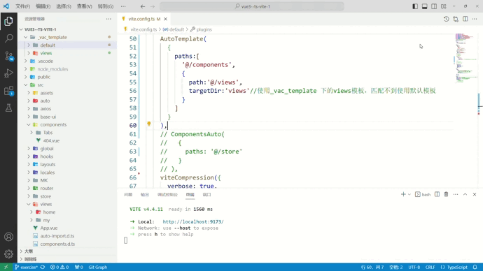

`vite-auto-template` This is a plugin designed specifically for the Vite build tool, and its main function is to automatically monitor changes in specified folders and generate specific template files. The purpose of this plugin is to provide a convenient way for developers to automatically generate template files during the project development process, thereby improving work efficiency.

[中文](/README.md)

## The core functionality of the plugin

*   **Automatic folder monitoring** It automatically monitors the folders you specify, with a focus on detecting changes as soon as a new folder is created. Once a new folder appears, the plugin automatically responds and triggers the generation of specific templates.
*   **Custom templates**  You can define the structure and content of the template files to suit your project's requirements. This way, you can ensure that the generated files adhere to the project's specifications and standards.
*   **Automated generation** When the plugin detects the addition of a new folder, it automatically initiates the template generation process without manual intervention. This is especially useful for tasks that require creating similar folder structures for each new feature or module.
*   **Improved Productivity** The automatic template generation feature can significantly boost developers' productivity by reducing the need for manual creation of folders and files, while also minimizing the chances of errors.

## Demo Presentation



## Installation

You can install the `vite-auto-template` plugin using npm or yarn:
``` 
npm install vite-auto-template --save-dev
# 或
yarn add vite-auto-template --dev
```

## Quick Start
To use the `vite-auto-template` plugin in your Vite project, follow these steps:

**Configure the Plugin** `vite.config.ts`
``` ts
import { defineConfig } from 'vite';
import AutoTemplate from 'vite-auto-template';

export default defineConfig({
  // ... Other Vite Configuration Options

  plugins: [
    // By default, it monitors the 'components' folder and uses the default template
    AutoTemplate(),
  ],
});
```
`No need to create manually, templates are generated automatically`

## Configuration Options

|  Name    | Type   |Description|
|  ----  | ----  |--|
| paths  | `string``PathsObj[]`|Default monitoring of the `components`folder, supports `string`，`string[]`，`string PathsObj[]`|
- PathsObj
    |  Name   | Type |Default  |Description|
    |  ----  | ----  |--|---|
    | path  | `string`|true|Path|
    | targetDir  | `string`|false|Specify filenames under the `_vac_template` folder, if not recognized, default template is used.|
    | oname  | `StringOrStringFunction`|false|Original Naming Placeholder|
    | hname  | `StringOrStringFunction`|false|Hyphenated Naming Placeholder|
    | uname  | `StringOrStringFunction`|false|Underscore Naming Placeholder|
    | pcname  | `StringOrStringFunction`|false|PascalCase Naming Placeholder|
    | ccname  | `StringOrStringFunction`|false|camelCase Naming Placeholder|
- StringOrStringFunction `string|((originName:string) => string)`

## EJS Template Explanation
|  Name    | Type   |Description|
|  ----  | ----  |--|
| oname  | `string`|Original Naming Placeholder|
| hname  | `string`|Hyphenated Naming Placeholder|
| uname  | `string`|Underscore Naming Placeholder|
| pcname  | `string`|PascalCase Naming Placeholder|
| ccname  | `string`|camelCase Naming Placeholder|

## Notes
|  Name  |Description|
|  ----  |--|
| [xxx].vue.ejs  | Use `[]` to represent the folder name inherited during creation.|
| index.ts.ejs  | Not using [] represents using the current name.|
| index.ts  |  Files without the `ejs` extension will be copied directly.|

## Advanced Usage Examples
- string 
    ``` ts
    AutoTemplate(
      {
        paths:'@/components',//Default template is used by default.
      }
    )
    ```
 - string[]
    ``` ts
    AutoTemplate(
      {
        paths:['@/components']//Default template is used by default.
      }
    )
    ```
 - object[] 
     ```ts
     AutoTemplate(
      {
        paths:[{
          path:'@/components'//Default template is used by default.
        },{
          path:'@/views',
          targetDir:'views'//Using templates under _vac_template/views, if no match is found, default template is used.
        }]
      }
    )
     ```
  - (string| object)[]
    ``` ts
    AutoTemplate(
      {
        paths:[
          '@/components',
          {
            path:'@/views',
            targetDir:'views'//Using templates under _vac_template/views, if no match is found, default template is used.
          }
        ]
      }
    )
    ```

## Changelog
- **v1.0.0** :Supports Custom Naming Conventions and Additional Custom Templates.

## 其他插件
| Name| Description|
| ---------------------------------------------------------------------- | ------------------------------------------------------------------------ |
| [vite-auto-pinia](https://www.npmjs.com/package/vite-auto-template) | A plugin designed specifically for the Vite build tool that can automatically generate Pinia files for you while also supporting hot-reloading entry configuration. 